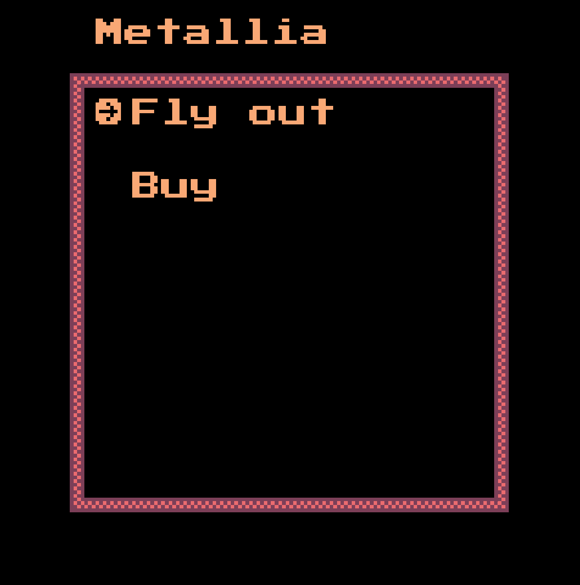

# wasm4-spacesim

A game written in Rust for the [WASM-4](https://wasm4.org) fantasy console.

See it in action [HERE](https://itch.io/embed-upload/7476472?color=333333) !

[](https://itch.io/embed-upload/7476472?color=333333)
[](https://itch.io/embed-upload/7476472?color=333333)

## The game

You fly a spaceship in the vast and empty universe

Commands:
- ↑, ↓, ←, → : Yaw and Pitch the spaceship
- \<PRIMARY BUTTON\> (mostly \<SPACE\>) confirm some actions (you'll be notified when it can be used)
- \<SECONDARY BUTTON\> (for me it's `À` but it may be `W` or `Z`) combined with either ↑ or ↓ accelerates/decelerates

## Building

Build the cart by running:

```shell
make prepare-distribution
```

Then open `dist/index.html` with your browser to run the game !


For more info about setting up WASM-4, see the [quickstart guide](https://wasm4.org/docs/getting-started/setup?code-lang=rust#quickstart).

## Links

- [Documentation](https://wasm4.org/docs): Learn more about WASM-4.
- [Snake Tutorial](https://wasm4.org/docs/tutorials/snake/goal): Learn how to build a complete game
  with a step-by-step tutorial.
- [GitHub](https://github.com/aduros/wasm4): Submit an issue or PR. Contributions are welcome!
